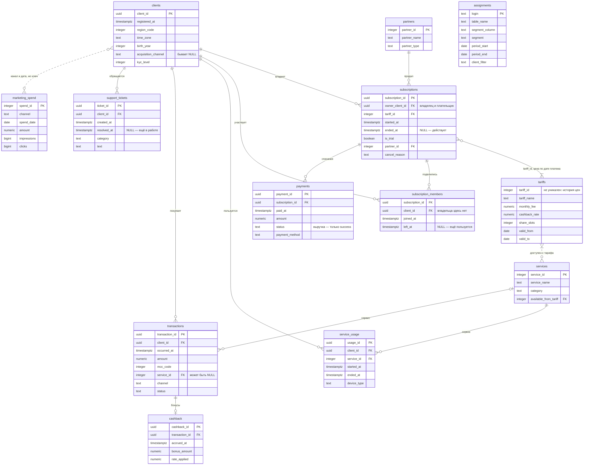

# Учебные данные: экосистемная подписка ПРАЙМ

> **Данные синтетические.** Они смоделированы по публично известным характеристикам подписочных сервисов. Никакие реальные клиентские данные здесь не используются и использоваться не будут.

---

## Легенда

**ПРАЙМ** — платная подписка цифровой экосистемы. Клиент платит абонентскую плату и получает доступ к партнёрским сервисам: онлайн-кинотеатр, музыка, доставка продуктов и товаров, каршеринг, аптека, связь. Подпиской можно поделиться с близкими. За покупки в партнёрских сервисах начисляется кэшбэк.

**Как зарабатывает:** абонентская плата, комиссия с оборота в партнёрских сервисах, рост транзакционной активности подписчиков.
**Как тратит:** привлечение клиентов, кэшбэк, выплаты партнёрам.

Два тарифа — базовый и расширенный. Есть триальный период.

## Где лежат данные

На учебном сервере, в PostgreSQL, в схеме `prime`. Доступ выдаётся на первом семинаре: чтение общей схемы и **своя схема на запись** для промежуточных результатов.

Как подключиться — в [справке](../справка/подключение-к-базе.md).

В теме 10 добавляется ClickHouse с денормализованной таблицей событий — на ней видно, зачем нужны колоночные хранилища.

**Локально данные не хранятся и в репозиторий не коммитятся.** Если вам нужна выгрузка — она живёт в вашей рабочей папке, а `.gitignore` не даст её случайно закоммитить.

---

## Что в базе

Тринадцать таблиц, **20,8 млн строк**, около 3 ГБ. История — с **6 января 2025** по **30 августа 2026**; клиенты регистрировались начиная с января 2024.

| Таблица | Строк | О чём |
|---|---:|---|
| [`clients`](#clients) | 500 000 | клиенты: когда пришли, откуда, где живут |
| [`subscriptions`](#subscriptions) | 333 905 | подписки: когда оформлена, когда отменена и почему |
| [`subscription_members`](#subscription_members) | 555 858 | с кем поделились подпиской |
| [`tariffs`](#tariffs) | 5 | справочник цен с историей |
| [`payments`](#payments) | 3 147 409 | списания абонентской платы |
| [`partners`](#partners) | 7 | каналы партнёрских продаж |
| [`services`](#services) | 12 | сервисы внутри подписки |
| [`service_usage`](#service_usage) | 7 968 633 | сессии пользования сервисами |
| [`transactions`](#transactions) | 5 974 972 | покупки клиентов в партнёрских сервисах |
| [`cashback`](#cashback) | 2 204 058 | начисления бонусов за покупки |
| [`marketing_spend`](#marketing_spend) | 3 606 | расходы на привлечение по дням и каналам |
| [`support_tickets`](#support_tickets) | 150 000 | обращения в поддержку |
| [`assignments`](#assignments) | 57 | ваш участок (персональный срез) для ДЗ-1 и сегмент для ДЗ-2 |

Обращаться к таблицам нужно с префиксом схемы: `prime.payments`, а не `payments`.

### Как это связано



**Как читать концы линий.** `||` — ровно одна строка, `o|` — ноль или одна, `o{` — ноль или много, `|{` — одна или много. Например, `subscriptions ||--o{ payments` читается так: каждый платёж относится ровно к одной подписке, а у подписки платежей ноль или много. Сплошная линия — связь по ключу, пунктирная — сопоставление не по ключу: `marketing_spend` сходится с клиентами по каналу и дате, `services` с тарифами — по номеру минимального тарифа.

Два места на схеме стоит разглядеть отдельно:

* **`subscriptions }o--|{ tariffs`.** У подписки не одна строка справочника, а одна или несколько: `tariff_id` в `tariffs` повторяется, потому что у цены есть история. Какая строка нужна, решает дата платежа — см. [`tariffs`](#tariffs).
* **`subscription_members` висит сразу на двух таблицах**, на `subscriptions` и на `clients`, и ключа у неё нет. Это та самая таблица, через которую получается двойной счёт.

**Ключи на схеме — логические.** Уникальность идентификаторов (`client_id`, `payment_id` и других с пометкой PK) база проверяет. А связи между таблицами — нет: внешние ключи в схеме не объявлены, и строку, которая ссылается на несуществующую подписку, база не остановит. Сверять связи при соединении — ваша работа.

<details>
<summary>Та же схема текстом — если диаграмма не отрисовалась</summary>

```
clients ──┬─< subscriptions >── tariffs        (по tariff_id и дате платежа)
          │         │      └──── partners
          │         ├─< subscription_members >── clients
          │         └─< payments
          ├─< service_usage >── services
          ├─< transactions >──< cashback
          └─< support_tickets

marketing_spend — ни с чем не связана ключом, сходится с clients
                  по каналу и дате
```

</details>

---

## Таблицы

### `clients`

Клиент экосистемы. Не обязательно подписчик: подписку оформили не все.

| Колонка | Тип | Что внутри |
|---|---|---|
| `client_id` | `uuid` | ключ |
| `registered_at` | `timestamptz` | регистрация в экосистеме, с января 2024 |
| `region_code` | `integer` | код региона, 1–89 |
| `time_zone` | `text` | IANA-имя: `Europe/Moscow`, `Asia/Kamchatka` и ещё девять |
| `birth_year` | `integer` | 1960–2006 |
| `acquisition_channel` | `text` | `organic`, `performance`, `partner_telecom`, `social`, `crm`, `referral` |
| `kyc_level` | `integer` | 1, 2 или 3 — глубина идентификации |

`acquisition_channel` заполнен не у всех. Это не ошибка выгрузки, а свойство данных: разбираться, что делать с пропусками, вы будете в теме 03.

### `subscriptions`

Подписка. Одна строка — одно оформление.

| Колонка | Тип | Что внутри |
|---|---|---|
| `subscription_id` | `uuid` | ключ |
| `owner_client_id` | `uuid` | владелец, он же плательщик → `clients` |
| `tariff_id` | `integer` | → `tariffs` |
| `started_at` | `timestamptz` | оформлена |
| `ended_at` | `timestamptz` | отменена; **`NULL` — значит, действует** |
| `is_trial` | `boolean` | оформлена в триальный период |
| `partner_id` | `integer` | канал продажи → `partners` |
| `cancel_reason` | `text` | `not_using`, `too_expensive`, `switched`, `payment_failed`, `other`; `NULL` у действующих |

Активных на конец истории — 167 978.

### `subscription_members`

**Самая опасная таблица в базе.** Читайте описание целиком.

| Колонка | Тип | Что внутри |
|---|---|---|
| `subscription_id` | `uuid` | → `subscriptions` |
| `client_id` | `uuid` | → `clients` |
| `joined_at` | `timestamptz` | присоединился |
| `left_at` | `timestamptz` | вышел; `NULL` — ещё пользуется |

Два свойства, которые ломают расчёты, если их не знать:

* **Владельца здесь нет.** В таблицу попадают только те, **с кем поделились**. Полный список пользователей подписки — это владелец из `subscriptions` **плюс** участники отсюда.
* **Строк нет у трети подписок.** Если подпиской не делились, в этой таблице для неё нет ни одной записи.

Отсюда — двойной счёт, который на первом семинаре разбирается отдельно. Соединяя платежи с подписками через участников, вы одновременно **раздуваете** результат (платёж повторяется на каждого участника) и **теряете** его (`inner join` выбрасывает подписки без участников). Число строк до и после соединения нужно сверять всегда.

Число участников ограничено полем `share_slots` тарифа.

### `tariffs`

Справочник цен **с историей**: у одного `tariff_id` несколько строк с разными интервалами действия.

| Колонка | Тип | Что внутри |
|---|---|---|
| `tariff_id` | `integer` | 1 — Базовый, 2 — Расширенный |
| `tariff_name` | `text` | название |
| `monthly_fee` | `numeric(12,2)` | абонентская плата |
| `cashback_rate` | `numeric(6,4)` | ставка кэшбэка: 1 % и 3 % |
| `share_slots` | `integer` | сколько человек можно подключить: 3 и 5 |
| `valid_from`, `valid_to` | `date` | интервал действия цены |

Соединять платёж с ценой надо по `tariff_id` **и** попаданию `paid_at` в интервал. Прежде чем это делать — проверьте справочник на пересекающиеся интервалы. Проверять справочники входит в работу; выглядят они убедительно всегда.

### `payments`

Списание абонентской платы. Примерно раз в 30 дней на каждую действующую подписку.

| Колонка | Тип | Что внутри |
|---|---|---|
| `payment_id` | `uuid` | ключ |
| `subscription_id` | `uuid` | → `subscriptions` |
| `paid_at` | `timestamptz` | момент списания |
| `amount` | `numeric(12,2)` | сумма |
| `status` | `text` | `success`, `failed`, `refunded` |
| `payment_method` | `text` | `card`, `sbp`, `wallet`, `balance` |

Выручкой становятся только `success`. `failed` — попытка списания, которая не прошла; `refunded` — возврат.

### `partners`

| Колонка | Тип | Что внутри |
|---|---|---|
| `partner_id` | `integer` | ключ |
| `partner_name` | `text` | Прямые продажи, Мобильный оператор, Банк-партнёр, Маркетплейс, Ритейл-сеть, Автодилер, Онлайн-кинотеатр |
| `partner_type` | `text` | `own`, `telecom`, `bank`, `marketplace`, `retail`, `auto`, `media` |

### `services`

| Колонка | Тип | Что внутри |
|---|---|---|
| `service_id` | `integer` | ключ |
| `service_name` | `text` | Кино, Музыка, Продукты, Каршеринг, Аптека, Мобильная связь и другие |
| `category` | `text` | `видео`, `музыка`, `доставка`, `каршеринг`, `аптека`, `связь` |
| `available_from_tariff` | `integer` | минимальный тариф, с которого сервис доступен |

### `service_usage`

Сессия пользования сервисом. Самая большая таблица — 1,2 ГБ.

| Колонка | Тип | Что внутри |
|---|---|---|
| `usage_id` | `uuid` | ключ |
| `client_id` | `uuid` | → `clients` |
| `service_id` | `integer` | → `services` |
| `started_at`, `ended_at` | `timestamptz` | начало и конец сессии |
| `device_type` | `text` | `mobile`, `desktop`, `tv`, `tablet` |

Здесь `client_id`, а не `subscription_id`: сервисом пользуется человек, а подписка у него может быть чужая — та, которой с ним поделились.

### `transactions`

Покупка клиента в партнёрском сервисе.

| Колонка | Тип | Что внутри |
|---|---|---|
| `transaction_id` | `uuid` | ключ |
| `client_id` | `uuid` | → `clients` |
| `occurred_at` | `timestamptz` | момент покупки |
| `amount` | `numeric(12,2)` | сумма |
| `mcc_code` | `integer` | категория торговой точки, 17 значений |
| `service_id` | `integer` | → `services` |
| `channel` | `text` | `app`, `web`, `pos` |
| `status` | `text` | `success`, `declined`, `reversed` |

### `cashback`

Начисление бонусов за покупку. Одна транзакция — не более одного начисления.

| Колонка | Тип | Что внутри |
|---|---|---|
| `cashback_id` | `uuid` | ключ |
| `transaction_id` | `uuid` | → `transactions` |
| `accrued_at` | `timestamptz` | момент начисления |
| `bonus_amount` | `numeric(12,2)` | сумма бонусов |
| `rate_applied` | `numeric(6,4)` | применённая ставка: 1 % или 3 % |

### `marketing_spend`

Расходы на привлечение. По одной строке на канал и день, 601 день истории.

| Колонка | Тип | Что внутри |
|---|---|---|
| `spend_id` | `integer` | ключ |
| `channel` | `text` | те же значения, что в `clients.acquisition_channel` |
| `spend_date` | `date` | день |
| `amount` | `numeric(14,2)` | потрачено |
| `impressions`, `clicks` | `bigint` | показы и клики |

Ключа на `clients` здесь нет — таблицы сходятся по каналу и дате. Из этой пары считается CAC, а с `payments` — LTV.

### `support_tickets`

Обращение в поддержку. Тексты на русском, короткие.

| Колонка | Тип | Что внутри |
|---|---|---|
| `ticket_id` | `uuid` | ключ |
| `client_id` | `uuid` | → `clients` |
| `created_at` | `timestamptz` | создано |
| `resolved_at` | `timestamptz` | закрыто; `NULL` — ещё в работе |
| `category` | `text` | `оплата`, `доступ к сервису`, `кэшбэк`, `шеринг`, `отмена подписки`, `прочее` |
| `text` | `text` | текст обращения |

### `assignments`

Ваш участок для ДЗ-1 (на первом семинаре — «персональный срез»): по строке на каждого студента. Каждый видит только свою строку.

| Колонка | Тип | Что внутри |
|---|---|---|
| `login` | `text` | ваш логин в базе |
| `table_name` | `text` | с какой таблицей работаете |
| `segment_column`, `segment` | `text` | какой срез берёте |
| `period_start`, `period_end` | `date` | за какой период |
| `client_filter` | `text` | ваш сегмент для хвоста С4 и ДЗ-2 — клиенты, которые встречаются в вашей таблице с вашим признаком за ваш период. Готовое условие: вставляется в `where` как есть |

Своя строка достаётся так:

```sql
select * from prime.assignments where login = current_user;
```

---

## Три места, на которых спотыкаются почти все

**1. `subscription_members` и двойной счёт.** Подробно — [выше](#subscription_members). Короткое правило: сверяйте число строк до и после каждого соединения.

**2. `clients.time_zone`.** Клиенты живут в 11 часовых поясах, а все отметки времени в базе хранятся в UTC. «Выручка за день» по UTC и «выручка за день» в локальном времени клиента — разные числа. Какое из них правильное, зависит от вопроса, на который вы отвечаете. Тема 05.

**3. Деньги — это `numeric`, а не `float`.** В базе суммы лежат в `numeric(12,2)` и сходятся до копейки. pandas при чтении превратит их в `float64`, и после нескольких операций копейки начнут расходиться. Где это важно — считайте в базе или приводите тип осознанно.

---

## Внешние источники

В теме 10 к учебным данным подмешиваются реальные открытые источники:

| Источник | Что даёт | Формат |
|---|---|---|
| [СберИндекс](https://sberindex.ru/ru/dashboards) | Потребительские расходы по категориям и регионам | Файлы выгрузки |
| [Банк России](https://www.cbr.ru/) | Курсы валют, ключевая ставка | XML |
| [ISS API Мосбиржи](https://iss.moex.com/) | Биржевые котировки | JSON с пагинацией |

Они нужны, чтобы отличать «упали мы» от «упал рынок».
